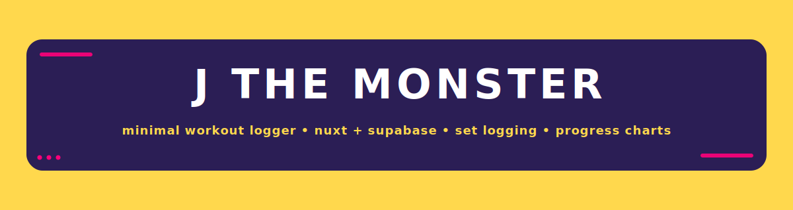

<p align="center">
  
</p>

## Table of Contents

- [Why](#why)
- [Features](#features-snapshot)
- [Tech Stack](#tech-stack)
- [Quickstart](#quickstart)
- [Database](#database)
- [Data Flow (store)](#data-flow-store)
- [LLM-Assisted Development](#llm-assisted-development)
- [Testing](#testing-manual)
- [Roadmap](#roadmap)
- [Acknowledgements](#acknowledgements)
- [License](#license)

<p align="center">
  <a href="https://nuxt.com"></a>
  <a href="https://vuejs.org/"></a>
  <a href="https://tailwindcss.com"></a>
  <a href="https://supabase.com"></a>
  <a href="https://www.chartjs.org/"></a>
  <a href="LICENSE"></a>
</p>

---
# J THE MONSTER

> **A minimal, single-user workout logger** I vibe-coded for my nephew to track sets, exercises, and progress without bloat.

## Why

- **Fast set logging** (two taps) so a beginner actually uses it
- **Opinionated catalog** of mass-builder exercises to avoid choice paralysis
- **Simple visuals** for adherence: *“Am I trending up?”*

## Features (snapshot)

- **Exercise Catalog**: ~105 movements across **chest / triceps / back / biceps / legs / shoulders / abs**
- **Log Sets Quickly**: pick body part → exercise → enter set; minimal friction
- **Typeahead Add Modal**: add custom exercises with **duplicate guard** + **keyboard nav**
- **Progress Chart**: top-set with soft fill; legible on dark surfaces
- **Flat, high-contrast UI**: purple surfaces, sun-yellow accents, fire-pink CTAs
- **Supabase RLS**: reads open for catalog; writes scoped to user

## Tech Stack

**Frontend**
- Nuxt 3 (Vue 3, Vite, TypeScript)
- Pinia (state)
- Tailwind CSS (utility styling)
- Chart.js via `vue-chartjs`

**Backend / Data**
- Supabase (Postgres, Auth, RLS)
- SQL seeds + lightweight policies

**Tooling**
- ESLint + Prettier
- pnpm (or npm/yarn)

## Quickstart

```bash
pnpm install                # or npm i / yarn
cp .env.example .env.local  # set Supabase URL + anon key
pnpm dev                    # http://localhost:3000
pnpm build && pnpm preview
```

Environment

```bash
NUXT_PUBLIC_SUPABASE_URL=https://<project-id>.supabase.co
NUXT_PUBLIC_SUPABASE_ANON_KEY=<anon>
```
Database
Current layout (simple): single table public.exercises
Catalog rows have user_id = NULL. User-added rows have user_id = auth.uid().

Schema (essential)

```sql
id uuid primary key default gen_random_uuid(),
user_id uuid null default auth.uid(),
name text not null,
body_part text not null,     -- 'chest'|'triceps'|'back'|'biceps'|'legs'|'shoulders'|'abs'
equipment text null,
created_at timestamptz not null default now()
```

Uniqueness

```sql
create unique index if not exists uniq_exercises_name_body_part
  on public.exercises (lower(name), body_part);
```

RLS

```sql
alter table public.exercises enable row level security;

-- read catalog + user rows
create policy if not exists exercises_select_all on public.exercises
for select using (true);

-- user-scoped writes; catalog (NULL user_id) seeded via SQL
create policy if not exists exercises_insert_own on public.exercises
for insert with check (auth.uid() = user_id or user_id is null);

create policy if not exists exercises_update_own on public.exercises
for update using (auth.uid() = user_id) with check (auth.uid() = user_id);
```

Seed

- supabase/sql/seed_exercises.sql (creates/patches + upserts ~105 rows), or
- import supabase/sql/exercises_seed.csv via Supabase Table Editor.

<details> <summary><strong>Alternative</strong>: split catalog into <code>exercise_catalog</code> (no user_id) + <code>exercises</code> (user rows)</summary>
Seed goes into <code>exercise_catalog</code> with the same unique index.
Client merges <em>catalog ∪ mine</em> in the store.
Cleaner isolation if you expect many user-added exercises.

</details>

Data Flow (store)

stores/exercises.ts

- loadAll()

catalog: SELECT … FROM exercises WHERE user_id IS NULL

mine: SELECT … FROM exercises WHERE user_id = auth.uid()

merge + keep in memory

- byPart(part) and search(q, part?) getters
- createCustom({ name, body_part, equipment })
  - local duplicate guard (case-insensitive within body part)
  - insert (RLS default fills user_id)
  - server uniqueness enforced by index

```mermaid
flowchart LR
  A[UI] -->|choose part| B[Store]
  B -->|loadAll()| C[(Supabase)]
  C -->|catalog (user_id IS NULL)| B
  C -->|mine (user_id = auth.uid)| B
  B -->|byPart/search| A
  A -->|createCustom()| C
```

LLM-Assisted Development
- ChatGPT-5 (Thinking) — architecture, schema, UI polish
- Claude Sonnet 4 — component scaffolds, copyedits
- Gemini 2.5 Pro — test data, edge-case checks

Notes: prompts/diffs were iterated inline; no runtime LLM dependency.

Testing (manual)

```sql
-- catalog totals (expect ~15 each body_part)
select body_part, count(*) from public.exercises
where user_id is null group by 1 order by 1;

-- smoke check
select id, name, body_part, equipment, user_id
from public.exercises order by body_part, name limit 12;
```

Roadmap
- Inline set/rep logging from the list row
- Session templates (push/pull/legs)
- Export CSV
- Per-exercise PR tracking
- PWA offline cache

Acknowledgements
For my nephew. Thanks for the motivation.
And thanks to the LLMs for late-night pairing.

License
MIT — see LICENSE.


